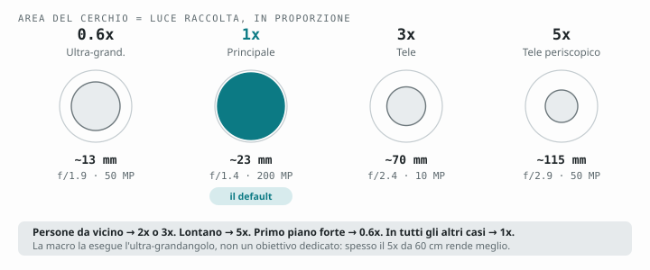

# Capitolo 1 — Le cinque fotocamere e quando usarle

[← Indice](README.md) · [Capitolo 2 →](02-leggere-i-numeri.md)

---

L'S26 Ultra non ha "una fotocamera con lo zoom". Ha **quattro fotocamere sul
retro più una davanti**, ognuna con un sensore diverso, un obiettivo diverso e
un carattere diverso. Lo slider dello zoom nell'app è una bugia gentile: ti fa
credere che esista un continuo da 0.6x a 100x, mentre in realtà stai saltando
fra quattro macchine fotografiche differenti, e in mezzo il telefono ritaglia
e inventa.

Il primo salto di qualità nelle tue foto non viene da un'impostazione: viene
dal sapere **quale delle quattro stai usando**.

---

## 1.1 Il quadro d'insieme

| Obiettivo | Sensore | Focale equiv. | Apertura | OIS | Fuoco minimo |
|---|---|---|---|---|---|
| **Ultra-grandangolo** (0.6x) | 50 MP, 1/2.5" | ~13 mm | f/1.9 | No | pochi cm (macro) |
| **Principale** (1x) | 200 MP, 1/1.3" | ~23 mm | **f/1.4** | Sì | ~18 cm |
| **Tele 3x** | 10 MP, 1/3.94" | ~70 mm | f/2.4 | Sì | ~22 cm |
| **Tele 5x** (periscopio) | 50 MP, 1/2.52" | ~115 mm | f/2.9 | Sì | ~52 cm |
| **Frontale** | 12 MP, 1/3.2" | ~23 mm | f/2.2 | No | — |



Tre cose saltano all'occhio, e sono le tre che contano:

1. **Il principale è enormemente più grande degli altri.** Un sensore da 1/1.3"
   ha circa **quattro volte** la superficie del tele 5x e più di **nove volte**
   quella del tele 3x. Nella scarsa luce non c'è partita.
2. **L'apertura f/1.4 del principale è il vero aggiornamento** di questa
   generazione: raccoglie circa il 47% di luce in più rispetto all'f/1.7
   della generazione precedente. È quasi mezzo stop.
3. **Il tele 3x è l'anello debole.** 10 MP su un sensore minuscolo, f/2.4. È lì
   per coprire un buco nella scala, non perché sia bello.

---

## 1.2 Il principale (1x) — il tuo obiettivo di default

**Sensore:** 200 MP ISOCELL HP2, 1/1.3", pixel da 0.6 µm che diventano 2.4 µm
quando il telefono li unisce a gruppi di sedici.
**Obiettivo:** ~23 mm equivalenti, f/1.4, stabilizzato otticamente.

Questa è la fotocamera vera. Le altre tre sono specialiste; questa è la
generalista che vince quasi sempre.

**Usala per:** tutto, salvo motivo contrario. Paesaggio, strada, gruppo di
persone, interni, cibo, concerti, notte, video.

**Il suo limite reale:** i 23 mm sono *larghi*. Se inquadri una persona a
mezzo busto da vicino, il naso e le mani in avanti si allungano. Non è un
difetto del telefono, è geometria: per un ritratto naturale servono almeno
50 mm equivalenti, cioè 2x o più.

**La regola che uso:** se il soggetto è una **persona**, non scattare a 1x da
vicino. Fai due passi indietro e vai a 2x o 3x.

**Fuoco minimo ~18 cm:** se ti avvicini di più, il principale non mette a
fuoco. A quel punto il telefono passa da solo all'ultra-grandangolo in modalità
macro — e la qualità crolla. Vedi § 1.5.

---

## 1.3 L'ultra-grandangolo (0.6x) — spettacolare e traditore

**Sensore:** 50 MP, 1/2.5", f/1.9, campo visivo 120°, **senza stabilizzazione
ottica**, con autofocus dual-pixel.

**Usala per:**
- architettura e interni stretti (la stanza sembra il doppio);
- paesaggi con un primo piano forte a mezzo metro dall'obiettivo;
- video in movimento a piedi: il grandangolo perde meno le vibrazioni;
- macro, perché è l'unica che mette a fuoco a pochi centimetri.

**Non usarla per:**
- **ritratti**, mai. A 13 mm una faccia al centro si gonfia e ai bordi si
  stira. È l'errore più comune di chi prende in mano un Ultra.
- **poca luce**, se puoi evitarlo. Il sensore è piccolo e non ha OIS: nelle
  foto notturne a mano libera perde molto più del principale.

**Il trucco che fa la differenza:** l'ultra-grandangolo funziona solo se hai
**qualcosa di vicino** da mettere in primo piano. Un ultra-grandangolo puntato
su un panorama vuoto produce una foto piatta in cui le montagne sono puntini.
Avvicinati a un muro, a una roccia, a un fiore, a un tavolo apparecchiato:
la distorsione prospettica diventa un effetto, non un difetto.

---

## 1.4 I due tele — quello di servizio e quello buono

### Tele 3x (~70 mm, f/2.4, 10 MP)

È il più piccolo e il più debole del gruppo. Dieci megapixel su un sensore da
1/3.94" significa che in interni serali produce immagini morbide e rumorose,
e spesso il telefono preferisce ritagliare dal principale piuttosto che usarlo.

Ma i ~70 mm sono una **focale bellissima per i ritratti**: comprimono appena
i lineamenti, staccano il soggetto dallo sfondo, e la distanza di lavoro è
comoda. In buona luce il 3x è la tua focale da ritratto.

**Usalo quando:** c'è luce piena e vuoi un ritratto, un dettaglio, un piatto
visto dall'alto senza deformazioni.
**Evitalo quando:** è sera o sei in interno poco illuminato. Meglio 2x (ritaglio
dal principale) che 3x rumoroso.

### Tele 5x periscopico (~115 mm, f/2.9, 50 MP)

Questo è il tele serio. Sensore da 1/2.52" — grande quanto l'ultra-grandangolo —
50 megapixel, stabilizzato, con la nuova architettura ottica **ALoP**
(*All Lenses on Prism*) che permette a Samsung di tenere il modulo sottile
mantenendo un campo visivo interno ampio.

**Usalo per:** fauna, sport, dettagli architettonici, montagne, la luna,
ritratti molto compressi, e in generale ogni volta che non puoi avvicinarti.

**Il suo superpotere:** avendo 50 MP, un ritaglio al centro del sensore ti dà
un **10x a piena definizione utile** senza inventare niente. È il motivo per cui
sull'S26 Ultra il 10x è ancora una focale onesta mentre su altri telefoni è
già poltiglia. (Vedi [capitolo 5](05-zoom.md).)

**Il suo limite:** f/2.9 e distanza minima di fuoco di circa **52 cm**. Non ci
fotografi un oggetto sul tavolo davanti a te, e di sera fatica.

---

## 1.5 Macro: chi la fa davvero

L'S26 Ultra non ha un obiettivo macro dedicato. La macro la fa
l'**ultra-grandangolo**, che mette a fuoco a pochi centimetri. Quando avvicini
il telefono a un soggetto, One UI passa da solo a 0.6x e ritaglia al centro
per farti credere di essere ancora a 1x.

Due conseguenze pratiche:

- **La qualità macro è quella del sensore piccolo**, non quella del 200 MP.
  Aspettati meno dettaglio e più rumore di quanto suggerisca l'anteprima.
- **Sei tu a farti ombra.** A cinque centimetri il telefono copre la luce.
  Illumina di lato con una qualsiasi altra fonte — anche la torcia di un
  secondo telefono — e la foto cambia categoria.

**L'alternativa che quasi nessuno usa:** invece della macro vera, mettiti a
**50-60 cm con il tele 5x**. Ottieni un forte ingrandimento, uno sfondo
completamente sfocato e nessuna deformazione. Per fiori, insetti fermi e
dettagli di oggetti è quasi sempre un risultato migliore.

---

## 1.6 La fotocamera frontale

12 MP, f/2.2, ~23 mm equivalenti, con autofocus dual-pixel e un **ISP dedicato
con elaborazione AI** che lavora specificamente sugli incarnati: tiene i toni
della pelle naturali e conserva il dettaglio di capelli e sopracciglia invece
di spianare tutto.

**Due impostazioni da sistemare subito:**

1. **Salva i selfie come vedi in anteprima** — altrimenti il telefono
   specchia l'immagine e il risultato ti sembrerà "sbagliato" rispetto a
   quello che vedevi.
2. **Il campo visivo**: c'è un'inquadratura stretta e una larga. Quella larga
   serve solo per i gruppi; per te da solo, usa la stretta — deforma meno.

Per i video in prima persona la frontale arriva a **4K a 60 fps**, il che è
più che sufficiente. Ma se il video è importante, il posteriore principale è
un altro pianeta: usa quello e inquadrati con l'anteprima sullo schermo
esterno o con un treppiede e il timer.

---

## 1.7 L'albero decisionale, in sei righe

```
Il soggetto è una persona?
  → Sì, e sei vicino .............. 3x (o 2x se c'è poca luce)
  → Sì, ed è un gruppo ............ 1x, facendo due passi indietro
Il soggetto è lontano e non puoi avvicinarti?
  → Sì ............................ 5x (fino a 10x senza rimorsi)
Vuoi far entrare tutto / c'è un primo piano forte?
  → Sì ............................ 0.6x
In tutti gli altri casi ........... 1x
```

Tienilo a mente per una settimana e diventa automatico.

---

## Da ricordare

- Lo zoom non è continuo: stai cambiando **macchina fotografica**, non ingrandimento.
- Il **principale (1x)** vince quasi sempre, ma non sui volti da vicino.
- L'**ultra-grandangolo** senza un primo piano non serve a niente.
- Il **3x** è per la luce piena; il **5x** è il tele vero e regge il 10x.
- La **macro** la fa l'ultra-grandangolo: spesso il 5x da mezzo metro è meglio.

---

[← Indice](README.md) · [Capitolo 2 →](02-leggere-i-numeri.md)
