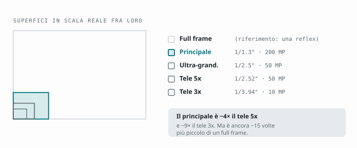
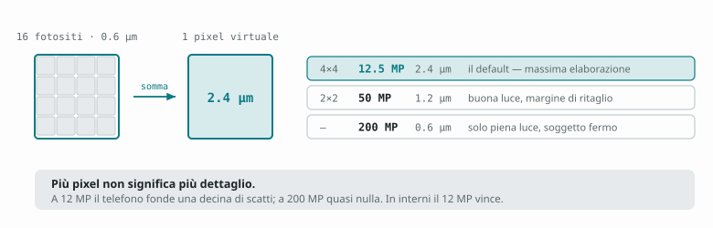
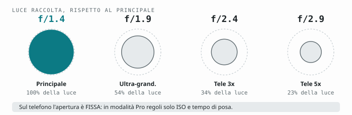

# Capitolo 2 — Come leggere i numeri

[← Capitolo 1](01-le-cinque-fotocamere.md) · [Indice](README.md) · [Capitolo 3 →](03-preparare-app.md)

---

La scheda tecnica di un telefono è scritta per il reparto marketing. Questo
capitolo traduce i cinque numeri che contano davvero, così quando leggi
"200 MP f/1.4 1/1.3\" con OIS" sai esattamente cosa aspettarti dalla foto.

Se hai fretta: **la dimensione del sensore batte i megapixel, l'apertura batte
i megapixel, e i megapixel non battono quasi niente.**

---

## 2.1 La dimensione del sensore — il numero più importante

Il sensore del principale è **1/1.3"**. Quello del tele 5x è 1/2.52". Quello
del tele 3x è 1/3.94". Sono frazioni di pollice, quindi **più piccolo è il
denominatore, più grande è il sensore**: 1/1.3" è molto più grande di 1/3.94".

Perché conta: un sensore più grande raccoglie più fotoni nello stesso tempo di
posa. Più fotoni significa **meno rumore**, **più gamma dinamica** (dettaglio
sia nelle ombre che nelle luci) e **meno bisogno che il software inventi**.

In termini di superficie, molto approssimativamente:

| Sensore | Superficie relativa |
|---|---|
| Principale 1/1.3" | **100%** (riferimento) |
| Ultra-grandangolo 1/2.5" | ~27% |
| Tele 5x 1/2.52" | ~27% |
| Tele 3x 1/3.94" | ~11% |
| Frontale 1/3.2" | ~17% |



Ecco perché nel capitolo precedente ripeto che il principale vince: **ha quasi
quattro volte** la luce degli altri a parità di condizioni.

**Il confronto che serve per avere le aspettative giuste:** un sensore
full-frame di una reflex è circa **quindici volte** più grande del principale
dell'S26 Ultra. Il telefono compensa con il software — e lo fa benissimo — ma
non con la fisica. Quando il software non può lavorare (soggetto in movimento
al buio) la differenza riappare tutta.

---

## 2.2 Il pixel binning, ovvero perché 200 MP diventano 12

Il sensore principale ha 200 milioni di fotositi da **0.6 µm** ciascuno.
Sono minuscoli: da soli raccoglierebbero pochissima luce e produrrebbero
un'immagine rumorosa.

Quindi il telefono li **somma**. Unendo 16 fotositi (4×4) ne ottiene uno
virtuale da **2.4 µm**, cioè con una superficie sedici volte maggiore. Il
risultato è un'immagine da **12.5 MP** molto più pulita di quanto sarebbe una
da 200 MP.

```
200 MP → binning 4×4 → 12.5 MP con pixel da 2.4 µm   ← il default, ed è giusto così
200 MP → binning 2×2 → 50 MP   con pixel da 1.2 µm
200 MP →   nessuno   → 200 MP  con pixel da 0.6 µm   ← solo in piena luce
```



**La conseguenza pratica:** scattare a 200 MP *non* ti dà "più dettaglio", ti dà
più pixel. In piena luce quei pixel contengono davvero informazione in più; in
qualsiasi altra condizione contengono rumore ingrandito, e il file pesa dieci
volte tanto. Il capitolo [4](04-risoluzione.md) entra nel dettaglio.

Lo stesso meccanismo vale per l'ultra-grandangolo e il tele 5x, che da 50 MP
scendono a 12.5 MP con pixel da 1.4 µm.

---

## 2.3 L'apertura: f/1.4 contro f/2.9

L'apertura è quanto è "spalancato" l'obiettivo. **Numero piccolo = più luce.**
La scala è geometrica: ogni passo raddoppia o dimezza.

```
f/1.4  →  f/2.0  →  f/2.8  →  f/4.0
  ←—— ogni passo dimezza la luce ——→
```

Sull'S26 Ultra:

| Obiettivo | Apertura | Luce relativa |
|---|---|---|
| Principale | **f/1.4** | 100% |
| Ultra-grandangolo | f/1.9 | ~54% |
| Tele 3x | f/2.4 | ~34% |
| Tele 5x | f/2.9 | ~23% |



Il principale raccoglie **più di quattro volte** la luce del tele 5x. Somma
questo al fatto che ha anche quattro volte la superficie di sensore e capisci
perché al tramonto la differenza fra 1x e 5x non è "un po'": è abissale.

Le aperture sul telefono sono **fisse**: non puoi chiuderle. Quando in modalità
Pro regoli l'esposizione, agisci solo su ISO e tempo di posa.

**Un avvertimento onesto sullo sfocato.** f/1.4 su un sensore da telefono non
produce lo sfondo cremoso di un f/1.4 su reflex. La profondità di campo dipende
anche dalla dimensione del sensore, e su un sensore piccolo è enorme: quasi
tutto è a fuoco. Lo sfocato che vedi nei ritratti del telefono è in larga parte
**calcolato dal software**. È molto buono, ma è una simulazione, e sui bordi
complicati (capelli, occhiali, rami) si vede.

---

## 2.4 La focale equivalente: perché "23 mm" è un'informazione e "1x" no

"1x" non vuol dire niente in assoluto: dipende da qual è l'obiettivo base.
La **focale equivalente** invece è universale, perché dice qual è l'angolo di
campo tradotto nella scala del 35 mm.

| Focale equiv. | Sull'S26 Ultra | A cosa corrisponde |
|---|---|---|
| ~13 mm | 0.6x | Ultra-grandangolo estremo: architettura, interni |
| ~23 mm | 1x | Grandangolo moderato: reportage, paesaggio, tuttofare |
| ~46 mm | 2x (ritaglio) | "Normale": la resa più simile all'occhio |
| ~70 mm | 3x | Ritratto classico |
| ~115 mm | 5x | Tele corto: dettaglio, compressione forte |
| ~230 mm | 10x (ritaglio) | Tele vero: fauna, sport, luna |

**La regola pratica dei ritratti:** sotto i 50 mm equivalenti i volti si
deformano. Da 70 mm in su si appiattiscono piacevolmente. È il motivo per cui
il 3x esiste su questo telefono.

---

## 2.5 OIS, VDIS e autofocus

**OIS** (stabilizzazione ottica) sposta fisicamente elementi dell'obiettivo per
compensare il tremolio della mano. Ce l'hanno il principale, il tele 3x e il
tele 5x. **Non** l'ultra-grandangolo, **non** la frontale.

Cosa ti regala l'OIS: la possibilità di usare tempi di posa più lunghi a mano
libera senza mosso. In pratica, **due o tre stop** di margine — la differenza
fra una foto notturna usabile e una da buttare.

Cosa **non** fa: congelare un soggetto in movimento. L'OIS corregge il
movimento *tuo*, non quello del soggetto. Se il bambino corre, ti serve un
tempo di posa breve, e l'OIS non ti aiuta. Questo è il malinteso più costoso
in fotografia da telefono.

**VDIS** è la stabilizzazione digitale: ritaglia e ruota l'immagine fotogramma
per fotogramma. Costa campo visivo e un po' di nitidezza, ma in video fa
miracoli. Ne parliamo nel [capitolo 13](13-stabilizzazione.md).

**PDAF / dual-pixel PDAF** è il sistema di messa a fuoco a rilevamento di fase:
il sensore stesso misura quanto e in che direzione è sfocato, e l'obiettivo ci
va in un colpo solo invece di "cercare". Il principale ha PDAF multi-direzionale
(funziona anche sui dettagli orizzontali, non solo verticali), l'ultra-grandangolo
e la frontale hanno il dual-pixel, che è il più preciso.

---

## 2.6 HDR e multi-frame: la foto che scatti non è una foto

Quando premi il pulsante, il telefono non cattura un'immagine. Ne cattura da
cinque a quindici in una frazione di secondo, con esposizioni diverse, poi le
allinea e le fonde. Il motore che coordina tutto questo Samsung lo chiama
**ProVisual Engine**: analizza la scena in tempo reale e decide texture,
riduzione rumore e trattamento del colore zona per zona.

Da qui derivano tre comportamenti che sembrano bug e non lo sono:

1. **L'anteprima è più scura della foto finale.** Normale: l'anteprima è un
   singolo fotogramma, il risultato è la fusione.
2. **Se muovi il telefono subito dopo lo scatto, la foto viene sporca.**
   Stavi interrompendo la raffica. Tieni fermo mezzo secondo in più — soprattutto
   di sera.
3. **Soggetti in movimento producono "fantasmi" o zone piatte.** L'algoritmo non
   riesce ad allineare i fotogrammi e sceglie di scartare. Se il soggetto si
   muove, vai in [modalità Pro](06-modalita-pro.md) e imposta un tempo breve.

---

## 2.7 Le cinque affermazioni da smontare

| Si dice | In realtà |
|---|---|
| "200 MP è 16 volte meglio di 12 MP" | 16 volte più pixel, quasi mai più dettaglio reale. Serve luce piena. |
| "f/1.4 sfoca lo sfondo come una reflex" | No: su sensore piccolo la profondità di campo resta grande. Lo sfocato è software. |
| "Lo zoom 100x è zoom" | Oltre il 10x è ricostruzione algoritmica. Utile per leggere un cartello, non per fare una foto. |
| "L'OIS elimina il mosso" | Elimina il *tuo* tremolio, non il movimento del soggetto. |
| "La modalità Pro fa foto migliori" | Fa foto *diverse*, con meno elaborazione. Spesso l'automatico vince. Vedi [cap. 6](06-modalita-pro.md). |

---

## Da ricordare

- **Superficie del sensore e apertura** contano più dei megapixel, sempre.
- Il **binning** è il motivo per cui 12 MP sono la scelta giusta il 95% delle volte.
- La **focale equivalente** è l'unico modo onesto di ragionare sull'inquadratura.
- L'**OIS** compra tempi lunghi, non congela il movimento.
- Ogni scatto è una **fusione di più fotogrammi**: tieni fermo mezzo secondo in più.

---

[← Capitolo 1](01-le-cinque-fotocamere.md) · [Indice](README.md) · [Capitolo 3 →](03-preparare-app.md)
