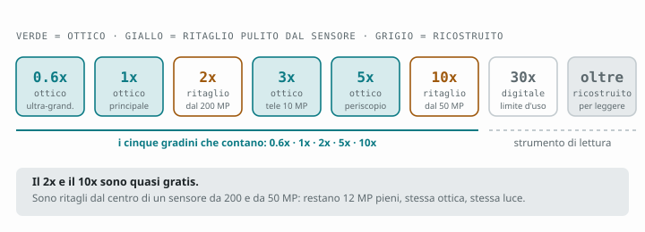

# Capitolo 5 — Lo zoom: la scala che conta

[← Capitolo 4](04-risoluzione.md) · [Indice](README.md) · [Capitolo 6 →](06-modalita-pro.md)

---

Sullo schermo lo zoom sembra un cursore continuo. Non lo è. È una scala a
gradini in cui alcuni gradini sono **ottici** (luce vera che passa attraverso
un obiettivo dedicato), altri sono **ritagli dal sensore** (onesti, senza
invenzione) e altri ancora sono **ricostruzione algoritmica** (il telefono
immagina il dettaglio che non c'è).

Sapere in quale categoria ti trovi è la differenza fra una foto e un ricordo
sfocato.

---

## 5.1 La scala completa, gradino per gradino

| Zoom | Obiettivo usato | Tipo | Qualità |
|---|---|---|---|
| **0.6x** | Ultra-grandangolo 50 MP | **Ottico** | Ottima in luce, media al buio |
| **1x** | Principale 200 MP | **Ottico** | Massima |
| **2x** | Principale, ritaglio 2× dal sensore | **Ritaglio pulito** | Eccellente |
| **3x** | Tele 10 MP | **Ottico** | Buona in luce piena, debole al buio |
| **5x** | Tele periscopico 50 MP | **Ottico** | Ottima |
| **10x** | Tele 5x, ritaglio 2× dal sensore | **Ritaglio pulito** | Molto buona |
| **~15–30x** | Tele 5x + interpolazione | **Digitale** | Accettabile con luce e treppiede |
| **oltre 30x** | Ricostruzione | **Algoritmico** | Documentale, non fotografico |



I gradini che contano — quelli da memorizzare e usare — sono **cinque**:

```
0.6x    1x    2x    5x    10x
```

Nota bene che il **3x non è in questa lista**. Non perché sia inutile — è la
focale da ritratto (cap. [1](01-le-cinque-fotocamere.md)) — ma perché in
condizioni di luce non perfette il 2x, che è un ritaglio dal sensore grande da
200 MP, spesso **batte** il 3x ottico su un sensore da 10 MP. Suona assurdo ed
è vero.

---

## 5.2 Il 2x è (quasi) gratis

Il principale ha 200 milioni di pixel. Ritagliando il quarto centrale ne
restano 50 milioni — che, con binning 2×2, danno ancora **12.5 MP pieni**.
Cioè: il 2x ti dà esattamente la stessa risoluzione finale del 1x, prendendo
luce dallo stesso sensore grande e dallo stesso obiettivo f/1.4.

Tecnicamente non è ottico, praticamente è indistinguibile.

**Conseguenza operativa:** il 2x (~46 mm equivalenti) è la focale "normale",
la più simile a come vede l'occhio, ed è quasi gratis. Usala molto più di
quanto fai. Per ritratti a mezzo busto, cibo, oggetti, dettagli urbani è
spesso l'inquadratura più naturale del telefono.

---

## 5.3 Il 10x, il vero regalo del periscopio

Stesso ragionamento, un gradino più su. Il tele 5x ha un sensore da 50 MP:
ritagliando il centro si ottengono 12.5 MP a **~230 mm equivalenti**.

Questo è il motivo per cui vale la pena avere l'Ultra invece di un telefono
normale. Un 230 mm in tasca, stabilizzato, che produce file di 12 MP utilizzabili
è roba che dieci anni fa richiedeva uno zaino.

**Con cosa funziona bene:** animali a distanza media, dettagli di facciate,
giocatori in campo, la luna, montagne lontane, persone riprese senza invadere.

**A cosa devi stare attento:** a 230 mm il tremolio della mano è amplificato
dieci volte. Le recensioni indicano lo **30x come limite pratico** superiore, ma
già a 10x servono accortezze:

- appoggiati a qualcosa — un muro, un palo, il tetto di un'auto;
- usa il **timer da 2 secondi** o il tasto del volume, non lo schermo;
- scatta in raffica e tieni il fotogramma più nitido;
- se il soggetto lo permette, aspetta che il mirino si "assesti": il
  telefono impiega un attimo a stabilizzare e mettere a fuoco a queste focali.

---

## 5.4 Oltre il 30x: cosa stai davvero guardando

Sopra il 30x l'immagine non viene più dal sensore in senso stretto. Il telefono
prende pochi pixel reali e usa modelli addestrati per "immaginare" come
dovrebbero apparire i bordi, il testo, la texture. È bravissimo con le scritte
e con la luna (che ha sempre lo stesso aspetto) ed è inventivo con tutto il
resto.

**Quando è legittimo usarlo:** leggere un numero civico, un orario sul tabellone,
il nome di una barca all'orizzonte. È uno strumento di lettura.

**Quando non lo è:** quando quella immagine la vuoi tenere come fotografia.
Ingrandita sullo schermo del PC, la ricostruzione si vede e non si può
disfare.

**Sulla luna in particolare:** il telefono la rende splendidamente, e ci sono
anni di discussione su quanto di quel dettaglio sia catturato e quanto
riconosciuto. Divertiti pure, ma sappi che non stai facendo astrofotografia.
Per quella c'è il [capitolo 7](07-expert-raw.md).

---

## 5.5 Come si passa da un obiettivo all'altro (e come evitare che lo faccia lui)

I numeri fissi sul mirino (0.6 / 1 / 3 / 5) selezionano l'obiettivo in modo
diretto. Il **cursore continuo**, invece, lascia decidere al telefono: e il
telefono, in poca luce, decide spesso di **non** usare il tele e di ritagliare
dal principale, perché sa che il sensore piccolo renderebbe peggio.

Questo produce il comportamento che confonde tutti: *"ho messo 3x ma la foto
sembra un ingrandimento digitale"*. Spesso lo è davvero — ed è stata la scelta
giusta.

**Come forzare l'obiettivo che vuoi:** usa la **modalità Pro** o **Expert RAW**,
dove la selezione dell'obiettivo è esplicita e il telefono non ti scavalca.
È anche l'unico modo affidabile di girare video sapendo quale ottica stai usando.

---

## 5.6 Zoom e video

In video la scala funziona diversamente, e peggio:

- il passaggio da un obiettivo all'altro **durante la ripresa** produce uno
  scatto di colore e di esposizione visibile in montaggio;
- in **Super Steady** il campo visivo è già ritagliato, quindi lo zoom parte
  da una base più stretta;
- lo **zoom digitale in ripresa** è molto più evidente che in foto, perché il
  rumore in movimento salta all'occhio.

**Tre regole per il video:**

1. **Scegli l'obiettivo prima di premere REC**, e non toccarlo più.
2. Se devi avvicinarti al soggetto, **cammina**: uno zoom fatto con i piedi ha
   parallasse vera e sembra cinema, uno zoom digitale sembra videosorveglianza.
3. Se proprio devi zoomare in ripresa, fallo **lentamente e dentro lo stesso
   obiettivo** (per esempio da 5x a 8x), mai a cavallo di un cambio di ottica.

---

## 5.7 Esercizio: la settimana a focale fissa

Il modo più veloce per imparare le focali è togliersi la scelta.

- **Lunedì–martedì:** solo 1x. Ti abitui a muoverti per inquadrare.
- **Mercoledì–giovedì:** solo 2x. Scoprirai che è la focale più naturale.
- **Venerdì:** solo 0.6x. Impari che serve un primo piano.
- **Sabato–domenica:** solo 5x. Impari a isolare e a comprimere.

Dopo una settimana saprai quale focale ti serve *prima* di alzare il telefono.
È l'abilità che separa chi fotografa da chi scatta.

---

## Da ricordare

- I gradini che contano sono **0.6x, 1x, 2x, 5x, 10x**.
- Il **2x** è un ritaglio dal 200 MP: qualità piena, focale naturale, usalo di più.
- Il **10x** è un ritaglio dal 50 MP del periscopio: è un vero 230 mm.
- Il **3x** è ottico ma su sensore piccolo: solo in luce piena.
- Oltre il **30x** stai leggendo, non fotografando.
- In **video**, scegli l'obiettivo prima di registrare e non cambiarlo.

---

[← Capitolo 4](04-risoluzione.md) · [Indice](README.md) · [Capitolo 6 →](06-modalita-pro.md)
