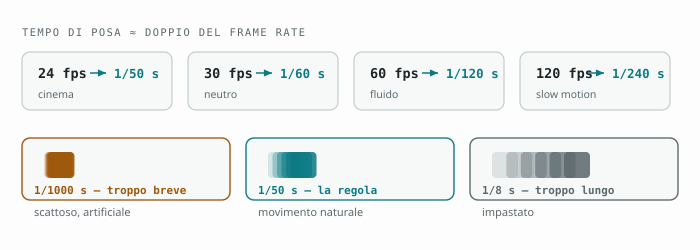

# Capitolo 10 — Impostazioni video: risoluzione, fps, codec

[← Capitolo 9](09-luce-composizione.md) · [Indice](README.md) · [Capitolo 11 →](11-log-e-colore.md)

---

Qui inizia la parte in cui l'S26 Ultra si stacca davvero dalla concorrenza.
Non tanto per i numeri — 8K ce l'hanno in molti — quanto per il **codec APV**,
di cui questo è il primo telefono al mondo a disporre, e per un set di
controlli manuali che assomiglia a quello di una cinepresa.

Ma prima bisogna mettere ordine in quattro numeri che vengono sempre confusi:
**risoluzione**, **frame rate**, **codec** e **profilo colore**.

---

## 10.1 Cosa può fare, per davvero

| Risoluzione | Frame rate | Su quali obiettivi |
|---|---|---|
| **8K** | 24 / 30 fps | Principale, ultra-grandangolo, tele 5x |
| **4K** | 24 / 30 / 60 / **120** fps | 120 fps su principale e ultra-grandangolo; 60 fps su tutti, frontale inclusa |
| **Full HD** | fino a **240** fps | Slow motion |
| **HD** | fino a **960** fps | Super slow motion |

**Nota importante:** l'**8K si ferma a 30 fps**. Non esiste 8K a 60. Se leggi il
contrario da qualche parte, è un rumor mai confermato dal prodotto finito.

---

## 10.2 La risoluzione: perché 4K è la risposta quasi sempre

**4K a 30 fps è il default giusto**, e cambiare ha senso solo con un motivo.

**Perché non 8K, di norma:**

- i file sono enormi (pensa a **600 MB–1 GB al minuto**);
- si ferma a 30 fps, quindi niente rallentatore e niente fluidità;
- il telefono si scalda e in registrazioni lunghe può ridurre le prestazioni;
- quasi nessuno lo guarderà mai su uno schermo 8K;
- il vantaggio percepito su un televisore 4K è minimo.

**Quando l'8K serve davvero:** quando prevedi di **ritagliare** in montaggio. Un
8K ti permette di estrarre due inquadrature diverse (campo largo e primo piano)
da una sola ripresa, restando in 4K pieno. Per interviste girate con un solo
telefono è un trucco potentissimo.

**Il vantaggio nascosto dell'8K:** puoi estrarre **fotogrammi da 33 MP** come
fossero foto. Per eventi veloci dove non sai quando succederà il momento
buono, girare in 8K e "pescare" il fotogramma è una strategia legittima.

---

## 10.3 Il frame rate: la scelta che decide come *sembra* il tuo video

Questa è la scelta più importante del capitolo, e non ha a che fare con la
qualità: ha a che fare con l'**estetica**.

| fps | Come appare | Quando usarlo |
|---|---|---|
| **24** | Cinematografico, leggero "stacco" nel movimento | Narrativa, video emozionali, look da film |
| **30** | Neutro, naturale | Default per tutto: documentazione, social, vlog |
| **60** | Fluidissimo, "videocamera", iper-reale | Sport, azione, e come **base per rallentare a metà** |
| **120** | Solo come sorgente per lo slow motion | Rallentato 4× o 5× in montaggio |

**Il punto che confonde tutti:** 60 fps non è "meglio" di 24 fps. È **diverso**.
Il motivo per cui i film sembrano film è precisamente che sono a 24 fps, con
un leggero mosso di movimento che il cervello legge come "cinema". A 60 fps la
stessa scena sembra una diretta televisiva. È l'effetto "soap opera".

**La strategia che consiglio:**

- **girare a 60 fps** quasi sempre, poi
- **montare su una timeline a 30 o 24 fps**, rallentando al 50% i momenti che
  vuoi enfatizzare.

Ottieni il rallentatore quando serve senza aver deciso in anticipo, e il
materiale resta utilizzabile a velocità normale.

**L'unica eccezione:** se non monterai mai il video, gira direttamente nel
frame rate finale.

---

## 10.4 L'otturatore: la regola dei 180°

Questa regola viene dal cinema e vale anche qui. Il tempo di posa di ogni
fotogramma dovrebbe essere circa **il doppio del frame rate**:

| Frame rate | Tempo di posa |
|---|---|
| 24 fps | 1/48 s (usa 1/50) |
| 30 fps | 1/60 s |
| 60 fps | 1/120 s |
| 120 fps | 1/240 s |

**Perché:** con questo rapporto il movimento ha la quantità "giusta" di mosso.
Con un tempo molto più breve (1/1000 s a 24 fps) il movimento diventa
scattoso e artificiale — l'effetto "sbarco in Normandia" di *Salvate il
soldato Ryan*, che lì era voluto. Con un tempo più lungo, tutto diventa
impastato.

Il tempo di posa lo imposti in **Pro Video** ([cap. 12](12-pro-video.md)). In
modalità Video normale ci pensa il telefono, e di solito lo fa bene.

**Il problema che questa regola crea:** in pieno sole, 1/60 s è troppa luce.
Non puoi chiudere il diaframma (è fisso). L'unica soluzione vera è un **filtro
ND** — un occhiale da sole per l'obiettivo — che si trova per telefoni a poco
prezzo con supporti a clip. Se giri video all'aperto regolarmente, è il
singolo accessorio che fa più differenza.

---

## 10.5 I codec: HEVC, H.264 e il nuovo APV

`Impostazioni fotocamera → Formati e opzioni avanzate`

### H.264 (AVC)
Il vecchio standard. Compatibile con tutto, file grandi, qualità inferiore a
parità di peso. Usalo solo se devi mandare il file a qualcuno con un computer
di quindici anni fa.

### HEVC (H.265) — **il tuo default**
Stessa qualità, circa **metà del peso**. Obbligatorio per 4K120, 8K, HDR10+ e
tutto ciò che è serio. Attivalo e dimenticalo.

### APV (Advanced Professional Video) — la novità
L'S26 Ultra è il **primo smartphone a supportare APV**, un codec pensato per la
produzione, non per la distribuzione.

Cosa lo rende diverso:

- è **quasi senza perdita** (near-lossless): conserva molte più informazioni
  di HEVC, soprattutto nelle gradazioni di colore;
- è **intra-frame**: ogni fotogramma è compresso in modo indipendente, quindi
  il montaggio è fluido e i tagli sono precisi al fotogramma (HEVC comprime
  interi gruppi di fotogrammi e i programmi devono ricostruirli);
- supporta **HDR10 e HDR10+**, gamut ampi, e colore a **10 e 12 bit**;
- arriva fino a **8K a 30 fps** oppure **4K a 120 fps**.

**Il prezzo:** i file sono **molto** più grandi di HEVC — parliamo di
diversi gigabyte al minuto ad alta risoluzione. E non è un formato che puoi
mandare su WhatsApp: è un formato di **acquisizione**, da cui esporti.

**Quando usare APV:**
- il materiale andrà in montaggio e in correzione colore;
- stai girando in Log (vedi [cap. 11](11-log-e-colore.md)), dove ogni bit di
  gradazione conta;
- è un lavoro che non potrai rifare.

**Quando non usarlo:** vlog, social, riprese di famiglia, qualsiasi cosa che
pubblicherai così com'è. HEVC è più che sufficiente e ti risparmia decine di
gigabyte.

**Un dettaglio operativo da conoscere:** nella **modalità Video normale** puoi
registrare in APV Log a **4K 60 fps** e in **8K 30 fps**. Per arrivare a
**4K APV Log a 120 fps** devi passare a **Pro Video**. È una di quelle
limitazioni che non sono documentate da nessuna parte e che fanno impazzire
chi non lo sa.

---

## 10.6 HDR10+ : attivarlo o no

`Impostazioni fotocamera → Formati avanzati → Video HDR10+`

Registra a **10 bit** con metadati dinamici: su uno schermo HDR i video hanno
una gamma di luminosità molto più ampia, cieli che non bruciano, luci al neon
che brillano davvero.

**Il problema è a valle.** Un video HDR10+ guardato su uno schermo o in
un'applicazione che non lo gestisce appare **slavato e con colori spenti** —
l'opposto di quello che volevi. E parecchi programmi di montaggio lo trattano
male.

**Il mio consiglio:**

- **se guarderai i video sul telefono o su un TV HDR recente: attivalo.**
  L'effetto è notevole.
- **se i video finiranno su un PC, in montaggio, o su piattaforme varie:
  lascialo spento** e usa piuttosto il Log ([cap. 11](11-log-e-colore.md)), che
  è pensato esattamente per quel flusso di lavoro.

Non attivarli entrambi aspettandoti che si sommino: sono due strategie
alternative per lo stesso problema.

---

## 10.7 Nightography Video

Il video in condizioni di scarsa luce sfrutta la nuova apertura **f/1.4** della
principale — circa il **47% di luce in più** rispetto alla generazione
precedente — più un'elaborazione dedicata di riduzione del rumore.

Nella pratica significa che il video notturno a 1x è di un'altra categoria
rispetto al video notturno a 3x o 5x. Se giri di sera:

- **resta a 1x** (o al massimo 2x, che è ritaglio dallo stesso sensore);
- **scendi a 4K 30 fps** o addirittura 1080p 30: meno fotogrammi al secondo
  significa più tempo di esposizione per ciascuno;
- **non usare Super Steady**, che ritagliando peggiora il rapporto segnale/rumore;
- appoggia il telefono ovunque puoi.

---

## 10.8 Le impostazioni consigliate, per tipo di lavoro

| Cosa stai girando | Risoluzione | fps | Codec | Colore |
|---|---|---|---|---|
| Vlog / social | 4K | 30 | HEVC | Standard |
| Video di famiglia | 4K | 30 | HEVC | HDR10+ se guardi sul telefono |
| Sport, azione | 4K | 60 | HEVC | Standard |
| Slow motion pianificato | 4K | 120 | HEVC | Standard |
| Video "cinematografico" | 4K | 24 | HEVC o APV | **Log** |
| Progetto serio da colorare | 4K | 24/60 | **APV** | **Log** |
| Interviste da ritagliare | 8K | 30 | HEVC | Standard |
| Notte | 4K o 1080p | 30 | HEVC | Standard |

---

## Da ricordare

- **4K 30** è il default; l'**8K** serve per ritagliare, non per la qualità percepita.
- **24 fps = cinema, 60 fps = realtà.** Non è una scala di qualità.
- Gira a **60 e monta a 30** se vuoi la libertà del rallentatore.
- Regola dei **180°**: tempo di posa ≈ doppio del frame rate.
- **HEVC** per tutto, **APV** solo per materiale che colorerai.
- **4K APV Log a 120 fps esiste solo in Pro Video.**
- **HDR10+ o Log**, non tutti e due.

---

[← Capitolo 9](09-luce-composizione.md) · [Indice](README.md) · [Capitolo 11 →](11-log-e-colore.md)
