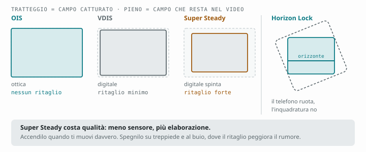
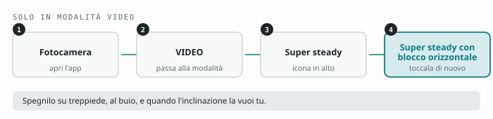

# Capitolo 13 — Stabilizzazione: OIS, Super Steady e Horizon Lock

[← Capitolo 12](12-pro-video.md) · [Indice](README.md) · [Capitolo 14 →](14-modalita-speciali.md)

---

Se dovessi indicare la funzione più sottovalutata dell'S26 Ultra, indicherei
**Horizon Lock**. Diverse recensioni l'hanno definita la vera novità della
generazione, davanti al sensore e all'apertura — e hanno ragione, perché
risolve un problema che nessun software di montaggio risolve bene.

Ma per capire cosa fa serve prima mettere in fila i tre livelli di
stabilizzazione che questo telefono ha.

---

## 13.1 I tre livelli, dal più leggero al più aggressivo



### Livello 1 — OIS (ottico)

Elementi dell'obiettivo si muovono fisicamente per compensare il tremolio.
**Non costa niente**: nessun ritaglio, nessuna perdita di qualità. È sempre
attivo su principale, tele 3x e tele 5x. L'ultra-grandangolo non ce l'ha.

Da solo, l'OIS basta per riprese statiche o con movimenti lenti.

### Livello 2 — VDIS (digitale, sempre attivo in video)

Il telefono ritaglia leggermente l'immagine e la sposta fotogramma per
fotogramma. Costa un po' di campo visivo e un filo di nitidezza. Lavora
insieme all'OIS e rende perfettamente utilizzabile una camminata lenta.

### Livello 3 — Super Steady

Il ritaglio diventa molto più aggressivo, l'analisi del movimento molto più
pesante. Il risultato assomiglia a un gimbal. Il prezzo:

- **campo visivo ridotto** in modo sensibile;
- **qualità inferiore**, perché stai usando meno sensore e più elaborazione;
- **risoluzione e frame rate limitati** rispetto al massimo;
- **peggior resa in scarsa luce**, perché il ritaglio penalizza il rapporto
  segnale/rumore.

**Quando accenderlo:** camminata veloce, corsa, bicicletta, sci, riprese da
un veicolo, bambini o cani inseguiti a piedi.

**Quando lasciarlo spento:** tutto il resto, e in particolare di sera. Molti lo
tengono acceso "per sicurezza" e pagano un pedaggio di qualità su ogni ripresa
senza accorgersene.

---

## 13.2 Horizon Lock: cosa fa davvero

È un **interruttore dentro Super Steady**, non una modalità separata.

**Dove si trova.** Nell'app la voce si chiama **Super steady con blocco
orizzontale** e compare toccando **due volte** l'icona Super steady, in alto
nel mirino. Esiste solo in modalità Video.



Il percorso segue la
[guida ufficiale Samsung](https://www.samsung.com/us/support/answer/ANS10010423/).

**Il problema che risolve.** Tutte le stabilizzazioni classiche correggono le
vibrazioni, ma non la **rotazione**: se cammini e il polso ruota, l'inquadratura
si inclina, e la si vede ondeggiare come una barca. È l'artefatto che più di
ogni altro fa sembrare "amatoriale" un video.

**Come lo risolve.** Il telefono combina un **angolo ottico più ampio** del
necessario (cioè cattura più di quello che ti mostra) con i dati di **giroscopio
e accelerometro**. Dai sensori ricava la **direzione della gravità** — cioè dove
è il basso, in assoluto — e ruota il fotogramma di conseguenza dentro l'area
extra catturata.

Il risultato: **l'orizzonte resta orizzontale anche se ruoti il telefono di
360 gradi completi.** Puoi far girare il dispositivo nella mano e l'immagine
resta dritta.

**Perché è meglio di farlo in montaggio:** la stabilizzazione rotazionale
applicata dopo deve ritagliare pesantemente e inventare i bordi. Qui i pixel in
più ci sono davvero, perché sono stati catturati apposta.

---

## 13.3 Come usare Horizon Lock nel modo giusto

**Attivalo per:**

- **riprese in movimento su terreno irregolare**: sentieri, scale, sassi;
- **riprese da veicolo**: auto, moto, bici, barca. Su una barca è quasi magico;
- **inseguimenti laterali**, dove segui un soggetto camminando di fianco;
- **passaggi di mano**, riprese dal basso verso l'alto, movimenti disinvolti;
- qualsiasi ripresa in cui il tuo polso non può stare fermo.

**Non attivarlo per:**

- **riprese su treppiede o statiche**: non serve a niente e paghi il ritaglio;
- **movimenti di macchina intenzionali inclinati** (un *dutch angle*): il
  telefono te lo raddrizzerà, che è esattamente ciò che non vuoi;
- **scarsa luce**, per i motivi già detti.

**Il limite da conoscere:** correggendo la rotazione dentro un'area catturata
più ampia, il sistema ha bisogno di margine. Nei movimenti rotatori molto
ampi e rapidi può arrivare al limite del margine disponibile, e in quel momento
l'orizzonte "cede" leggermente. Nella pratica succede raramente, ma se stai
girando qualcosa di importante con rotazioni estreme, fai una prova prima.

---

## 13.4 Tecnica di ripresa: quello che nessuna stabilizzazione può fare per te

Il software corregge le vibrazioni ad alta frequenza. **Non corregge il
rimbalzo di un passo.** Quello devi toglierlo tu.

### Come si tiene il telefono

```
□ Due mani, sempre. Anche per tre secondi di ripresa.
□ Gomiti appoggiati al torace: il corpo diventa un treppiede.
□ Cinghietta o laccio al polso: se non hai paura di farlo cadere,
  stringi meno, e stringere meno significa tremare meno.
□ Espira e trattieni: si riprende fra un respiro e l'altro.
```

### Come si cammina riprendendo

Si chiama "camminata dell'airone", e funziona:

1. **Ginocchia leggermente piegate**, sempre. Le gambe diventano sospensioni.
2. **Appoggia il piede dal tallone alla punta**, rullando, senza battere.
3. **Passi corti**, più corti del tuo passo normale.
4. **Il busto resta alla stessa altezza**: immagina di avere un bicchiere pieno
   sulla testa.
5. **Cammina di lato** per gli inseguimenti laterali, incrociando i piedi.

Cinque minuti di pratica in corridoio migliorano i tuoi video più di qualsiasi
impostazione in questo capitolo.

### Il movimento di macchina più utile che esista

Non è la panoramica, è il **movimento laterale lento con un oggetto in primo
piano**. Spostati di lato di un metro mentre riprendi, con qualcosa a mezzo
metro dall'obiettivo: la parallasse fra primo piano e sfondo crea profondità
tridimensionale. È il movimento che fa sembrare "prodotto" un video girato col
telefono.

---

## 13.5 Gimbal: serve o no?

Con OIS + VDIS + Super Steady + Horizon Lock, un gimbal è diventato un
accessorio **facoltativo** invece che necessario. Ma non è inutile.

**Un gimbal ti dà ancora tre cose che il software non dà:**

1. **movimenti lenti e perfettamente costanti** (carrellate, rotazioni
   controllate), impossibili a mano;
2. **nessun ritaglio**: usi tutto il sensore e tutta la qualità;
3. **funziona al buio**, dove Super Steady peggiora l'immagine.

**Quando comprarlo:** se giri narrativa, video musicali, immobiliare, o
qualsiasi cosa in cui i movimenti di macchina sono parte del linguaggio.

**Quando non serve:** vlog, viaggi, famiglia, social. Horizon Lock copre il 90%
di quei casi, sta in tasca e non ha bisogno di essere caricato.

**L'alternativa da 15 euro:** un piccolo **treppiede da tavolo pieghevole**.
Per riprese statiche, timelapse, interviste e autoritratti fa più di un gimbal,
costa un decimo e lo porti sempre con te.

---

## Da ricordare

- **OIS** è gratis, **VDIS** costa poco, **Super Steady** costa parecchio: accendilo solo quando serve.
- **Horizon Lock** sta dentro Super Steady e corregge la **rotazione**, non solo la vibrazione.
- Tiene l'orizzonte dritto anche ruotando di **360°**, perché cattura più campo del necessario.
- Spegnilo su treppiede, al buio, e quando vuoi un'inclinazione voluta.
- **Ginocchia piegate, passi corti, due mani**: la tecnica batte il software.
- Un **treppiede da tavolo** è più utile di un gimbal per la maggior parte delle persone.

---

[← Capitolo 12](12-pro-video.md) · [Indice](README.md) · [Capitolo 14 →](14-modalita-speciali.md)
